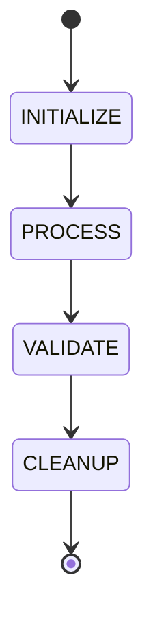

# Agent Lifecycle Protocol

All agents implement the four-stage state machine:

1. **INITIALIZE**: Allocate local buffers, register tools, unpack task envelopes.
2. **PROCESS**: Execute logic, spawn child subagents if needed.
3. **VALIDATE**: Audit outputs against schemas and quality gate thresholds.
4. **CLEANUP**: Release transient memory, remove temporary files, emit completion signals.
