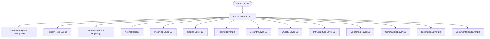

# System Architecture

## Overview
The Fractal Multi-Agent Autonomous Coding System organizes autonomous problem solving into a hierarchical, self-similar tree of specialized agents. No single monolithic model handles end-to-end execution. Instead, tasks are progressively decomposed into smaller, bounded scopes.

## High-Level Architecture Diagram

## System Layers
1. **Core Layer**: BaseAgent, Orchestrator, AgentRegistry, TaskQueue, StateManager, QualityGate, Monitor, Sandbox.
2. **Planning Layer (P1-P10)**: Intent Clarifier, Question Generator, Option Parser, Task Decomposer, Dependency Analyzer.
3. **Coding Layer (C1-C24)**: Backend, Frontend, Fullstack, API Route, Database, Middleware, Controller.
4. **Testing Layer (T1-T16)**: Test Orchestrator, Unit Test Generator, Integration Test Creator, Edge Case Finder.
5. **Security Layer (S1-S12)**: Security Orchestrator, Auth Checker, SQL Injection Scanner, Token Validator, Role Checker.
6. **Quality Layer (Q1-Q12)**: Quality Orchestrator, Code Formatter, Style Checker, Complexity Analyzer, Documentation Writer.
7. **Infrastructure Layer (I1-I14)**: Infrastructure Orchestrator, Docker Configurer, Compose Generator, CI/CD Setuper.
8. **CommState Layer (CS1-CS14)**: CommState Orchestrator, Task Store, Mailbox, Registry, Trace Depositor, Replay Engine.
9. **Monitoring Layer (M1-M14)**: Monitoring Orchestrator, Live Debugger, Metrics Collector, Alert Manager, Health Checker.
10. **Integration Layer (IA1-IA14)**: Integration Orchestrator, System Initializer, Agent Factory, Dependency Injector.
11. **Testing & Validation Layer (TV1-TV14)**: System Test Runner, Performance Runner, Validation Engine, Coverage Reporter.
12. **Documentation Layer (D1-D12)**: Documentation Orchestrator, API Documenter, Guides, Reference, FAQ.

## Communication Topology & Stigmergy
- **Direct Supervision**: Parents communicate strictly with direct children.
- **Blackboard & Stigmergy**: Indirect signaling via environmental traces (Attraction, Danger, Information) allowing emergent coordination without unconstrained peer chat.
