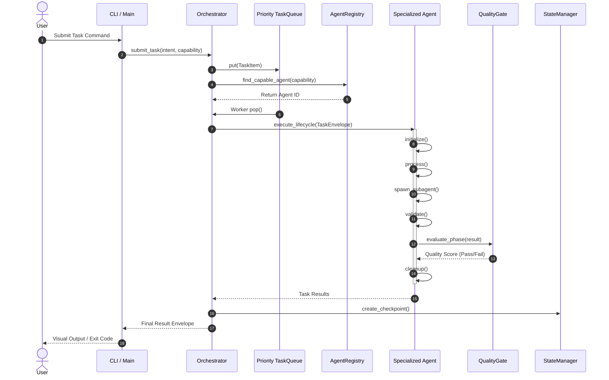

# Data Flow Architecture

## Task Lifecycle Data Flow

## Stigmergic Signaling Flow
1. **Emission**: Agent generates trace (e.g. `attraction`, `danger`, `information`).
2. **Deposition**: Blackboard records signal with timestamp, initial strength (1.0), and topic key.
3. **Decay**: Background worker applies exponential decay over time ($S(t) = S_0 \cdot e^{-\lambda t}$).
4. **Sensing**: Downstream agents poll local stigmergy space to avoid dangerous patterns or gravitate toward completed artifacts.
