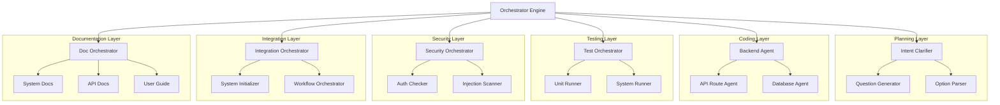
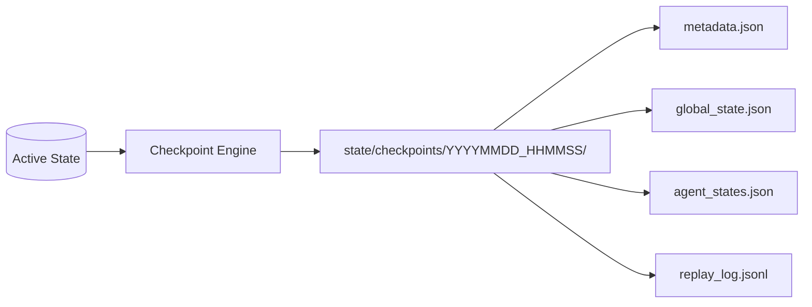

# System Architecture Diagrams

## Complete Multi-Agent Hierarchy

```mermaid
graph TD
    Root[Orchestrator Engine]

    subgraph Planning [Planning Layer]
        P1[Intent Clarifier] --> P2[Question Generator]
        P1 --> P3[Option Parser]
    end

    subgraph Coding [Coding Layer]
        C1[Backend Agent] --> C2[API Route Agent]
        C1 --> C3[Database Agent]
    end

    subgraph Testing [Testing Layer]
        T1[Test Orchestrator] --> T2[Unit Runner]
        T1 --> T3[System Runner]
    end

    subgraph Security [Security Layer]
        S1[Security Orchestrator] --> S2[Auth Checker]
        S1 --> S3[Injection Scanner]
    end

    subgraph Integration [Integration Layer]
        IA1[Integration Orchestrator] --> IA2[System Initializer]
        IA1 --> IA3[Workflow Orchestrator]
    end

    subgraph Documentation [Documentation Layer]
        D1[Doc Orchestrator] --> D2[System Docs]
        D1 --> D3[API Docs]
        D1 --> D4[User Guide]
    end

    Root --> P1
    Root --> C1
    Root --> T1
    Root --> S1
    Root --> IA1
    Root --> D1
```

## State & Checkpoint Persistence Diagram

```mermaid
flowchart LR
    ActiveState[(Active State)] --> CheckpointEngine[Checkpoint Engine]
    CheckpointEngine --> CheckpointDir[state/checkpoints/YYYYMMDD_HHMMSS/]
    CheckpointDir --> MetadataJSON[metadata.json]
    CheckpointDir --> GlobalStateJSON[global_state.json]
    CheckpointDir --> AgentStateJSON[agent_states.json]
    CheckpointDir --> ReplayLog[replay_log.jsonl]
```
